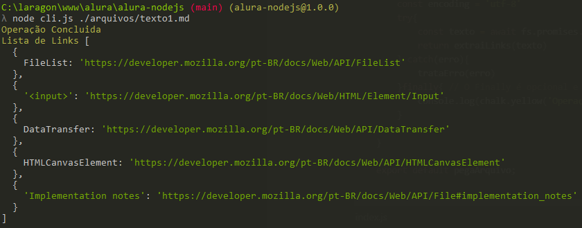

# Node.js : Minha Primeira Biblioteca em Node.js

> **Autor: Vitor Migoto**
 - **Data: 14/04/2022** - 
*Documento baseado em treinamento de aula online do site Alura.*
------------
## O que veremos neste arquivo:

1. Criando o pacote package.json
    1. Instalando a lib Chalk (Opcional)
2. Criando o Arquivo .gitignore
3. Trabalhando com Leitura de Arquivo
4. Entendendo Promises
5. Async / Await
    1. Expressões Regulares (Opcional)
6. Aplicando o Regex na nossa função
7. Criando um arquivo que lê o caminho do CMD
8. Scripts
9. Montando uma opção de Validação dos Links
10. Trabalhando com Testes
    1. Instalando o Jest
    2. Criando o arquivo de testes
    3. Criando uma sequencia de testes    

## 1. Criando o Pacote package.json

Para iniciar, vamos iniciar o projeto digitando o seguinte comando:

```bash
npm init -y
```
## a. Instalando a lib Chalk (Opcional)

Digite o seguinte comando:

```bash
npm install chalk
```

Agora adicione no arquivo package.json  abaixo da linha `“main”:”index.js”` o seguinte código:

```bash
"main": "index.js",
"type": "module",
```

No arquivo index.js você pode utilizar agora a biblioteca Chalk importando da seguinte maneira:

```bash
import chalk from 'chalk';

console.log(chalk.blue("teste"))
```

## 2. Criando o arquivo .gitignore

Para podermos armazenar nosso projeto em um repositório online, não precisamos armazenar nossas bibliotecas, então iremos criar um arquivo chamado .gitignore para dizer ao GIT quais arquivos e pastas ele deve ignorar na hora de subir os dados para o repositório.

Crie um novo arquivo na raiz do projeto com o nome `.gitignore` (este arquivo deve iniciar com . [ponto]). Após isso, digite neste arquivo `node_modules` para que o GIT ignore os arquivos de biblioteca do repositório.

## 3. Trabalhando com Leitura de Arquivo

Para iniciarmos vamos utilizar um código que irá realizar a leitura de  um arquivo de texto. Para isso vamos precisar criar um diretório chamado arquivos/ e dentro dele vamos criar um arquivo com o nome [texto1.md](http://texto1.md) e vamos colocar o seguinte conteúdo:

```bash
A interface File provê informações sobre arquivos e permite ao JavaScript  a acessar seu conteúdo.

São geralmente recuperados a partir de um objeto [FileList](https://developer.mozilla.org/pt-BR/docs/Web/API/FileList) que é retornado como resultado da seleção, pelo usuário, de arquivos através do elemento [<input>](https://developer.mozilla.org/pt-BR/docs/Web/HTML/Element/Input), a partir do objeto [DataTransfer](https://developer.mozilla.org/pt-BR/docs/Web/API/DataTransfer) utilizado em operações de arrastar e soltar, ou a partir da API `mozGetAsFile()` em um [HTMLCanvasElement](https://developer.mozilla.org/pt-BR/docs/Web/API/HTMLCanvasElement). Em Gecko, códigos com privilégiios podem criar objetos File representando qualquer arquivo local sem a intereção do usuário (veja [Implementation notes](https://developer.mozilla.org/pt-BR/docs/Web/API/File#implementation_notes) para mais informações.)
```

Para realizar a leitura de um arquivo vamos utilizar uma lib do node chamada FS (FileStystem) para isso iremos importar em nosso arquivo index.js da seguinte maneira:

```bash
// Lib File System para ler arquivos
import fs from 'fs';
```

Para lermos o arquivo vamos utilizar uma função da lib FS que é o readFile, ela lê um arquivo, em um determinado formato e passa para uma função de callback. Sua sintaxe é a seguinte:

```bash
fs.readFile(caminhoArquivo, codificacao, funcao de callnack)
```

Nosso código do arquivo index.js ficará da seguinte maneira para trabalharmos a leitura do arquivo e o tratamento de erro.

```jsx
import chalk from 'chalk';

// Lib File System para ler arquivos
import fs from 'fs';

//Tratamento do Erro
function trataErro(erro){
    //Error é um objeto do node
    throw new Error(chalk.red(erro.code, 'Falha ao ler o arquivo'));
}

function pegaArquivo(caminhoDoArquivo){
    const encoding = 'utf-8'
    // readFile(caminhoArquivo, codificacao, funcao de callnack)
    fs.readFile(caminhoDoArquivo, encoding, (erro , texto)=>{
        //Tratando o Erro
        if(erro){
            trataErro(erro)
        }
        console.log(chalk.green(texto))
    })
}

pegaArquivo('./arquivos/texto1.md')
```

Neste arquivo vemos a tratativa de erro utilizando a função trataErro() onde retorna um throw a partir da falha da nossa função de call-back.

Nossa função de call-back possui dois parâmetros que é o `erro` e o `dado do arquivo`. por isso passamos as duas variáveis `erro` e `texto` dentro dos parênteses.

Se quisermos omitir um valor de parâmetro podemos utilizar um underline no lugar da variável conforme exemplo abaixo.

```jsx
fs.readFile(caminhoDoArquivo, encoding, (_ , texto)=>{
        console.log(chalk.green(texto))
    })
```

## 4. Entendendo Promises. Execução Assíncrona.

Quando temos um processo que não precisa terminar para que o restante do meu sistema continue a executar, precisamos aplicar o conceito de assincronismo, ou seja, quando minha função for executada ela irá gerar o que chamamos de uma promessa e meu sistema continua funcionando normalmente. Quando essa promessa terminar de ser executada ela então termina de  executar sua ação normalmente e isso não impacta o restante do meu sistema.

Transformando a nossa função para trabalhar com promises.

```jsx
function pegaArquivo(caminhoDoArquivo){
    const encoding = 'utf-8'
    fs.promises
    .readFile(caminhoDoArquivo, encoding)
    .then((texto) => console.log(chalk.green(texto)))
    .catch((erro) => trataErro(erro))
}
```

Com o parâmetro promises da biblioteca fs temos a oportunidade de usar a função readFile com esse método assincrono. Dessa maneira, quando usamos o método promises nós temos o parametro then() e o catch(). Esta é a forma como o JavaScript trabalha com as promises, onde em Then colocamos as funções que serão executadas quando a promessa for finalizada, e no Catch fazemos o envio para a função que irá tratar o erro caso a promessa retorne alguma falha.

## 5. Async / await

Para facilitar o JavaScript implementou um método mais simples e mais parecido com o uso do método síncrono. Para isso podemos apenas utilizar as palavras `async` e `await` para informar isso ao JavaScript e ele já vai entender que estamos fazendo uma função assíncrona. Para tratamento de erro podemos então apenas utilizar o método `try` `catch` para enviar o erro a nossa função em caso de falha. Veja como fica nossa mesma função usando o async e await.

```jsx
async function pegaArquivo(caminhoDoArquivo){    
    const encoding = 'utf-8'
    try{
        const texto = await fs.promises.readFile(caminhoDoArquivo, encoding)
        console.log(chalk.green(texto))
    } catch(erro){
        trataErro(erro)
    }
    
}
```

## a. Expressões Regulares (Opcional)

Expressões criadas para identificar padrões. As expressões Regulares utilizam uma sintaxe padrão e própria e podemos usar o site [regex101.com](http://regex101.com) para nos ajudar a formar estas expressões.

- Para buscar por filtros específicos devemos usar uma classe, toda classe é representada entre colchetes [ ]
    - [ abc ] → procura pelas 3 letras individualmente no texto
    - [ a-z ] → procura por todas as letras minúsculas do alfabeto no texto
    - [ A-z ] → procura por todas as letras do alfabeto no texto independente se maiúsculas ou minúsculas, nesse caso ele não pega letras com acentuações do nosso alfabeto português
    - [ ^abc ]→ o ^ faz com que a busca seja por todo o resto menos pelas letras a b ou c
    - [ \w ] → pega qualquer caractere de texto
    - [\s] → pega espaços em branco
    - \[ [ \w ] * \] → pega tudo que tiver entre os colchetes inclusive caracteres especiais
    - \[[^\]]*\] → pega tudo que não tiver colchetes fechando ]
    - \(https?:\/\/[^$#\s]*.[^\s]*\) → pega todo link entre parênteses
- Para localizarmos caracteres especiais devemos utilizar o escape que é representado pela barra invertida \ Exemplo: \[ → vai buscar todos os caracteres [ (abre colchetes) no texto

## 6. Aplicando o Regex na nossa função

Vamos criar agora uma função que vai filtrar o texto trazendo para mim uma array de resultados com o índice sendo a palavra e o valor sendo o link do conteúdo.

Nossa função ficará assim:

```jsx
function extraiLinks(texto){
		// REGEX criado para filtrar os items  dentro dos [] e ()
    const regex = /\[([^\]]*)\]\((https?:\/\/[^$#\s]*.[^\s]*)\)/gm;
    const arrayResultados = []
    let temp
		//Laço que vai montar nosso objeto com os conteudos
    while((temp = regex.exec(texto)) !== null){
        arrayResultados.push({ [temp[1]] : temp[2] })
    }
    return arrayResultados
}
```

## 7. Criando um arquivo que lê o caminho do CMD

Para executarmos nosso arquivo index vamos criar um novo arquivo que será responsável por executar nossa listagem de textos a partir do CMD. Crie um novo arquivo chamado cli.js e vamos colocar o seguinte código nele:

```jsx
import chalk from 'chalk';
import pegaArquivo from './index.js';

const caminho = process.argv;

async function processaTexto(caminhoDeArquivo){
    const resultado = await pegaArquivo(caminhoDeArquivo[2]);
    console.log(chalk.yellow('Lista de Links'), resultado);
}

processaTexto(caminho)
```

Como você viu acima, estamos importando do nosso arquivo index a função pegaArquivo. Para isso funcionar no final do arquivo index.js você irá adicionar a seguinte linha:

```jsx
export default pegaArquivo;
```

Faremos algumas mudanças no nosso arquivo index.js para podermos capturar o arquivo a partir do caminho passado pelo CMD assim nosso arquivo index.js ficará da seguinte forma:

```jsx
import chalk from 'chalk';
// Lib File System para ler arquivos
import fs from 'fs';

function extraiLinks(texto){
    const regex = /\[([^\]]*)\]\((https?:\/\/[^$#\s]*.[^\s]*)\)/gm;
    const arrayResultados = []
    let temp

    while((temp = regex.exec(texto)) !== null){
        arrayResultados.push({ [temp[1]] : temp[2] })
    }
    return arrayResultados.length === 0 ? 'Não há links' : arrayResultados;
}

//Tratamento do Erro
function trataErro(erro){
    //Error é um objeto do node
    throw new Error(chalk.red(erro.code, 'Falha ao ler o arquivo'))
}

//Função Assincrona usando async e await
async function pegaArquivo(caminhoDoArquivo){    
    const encoding = 'utf-8'
    try{
        const texto = await fs.promises.readFile(caminhoDoArquivo, encoding)
        return extraiLinks(texto)
    } catch(erro){
        trataErro(erro)
    }finally{ // O Finally é opcional e ele não tem parametros, ele executa uma ação após nossa função try ou catch ser executada.
        console.log(chalk.yellow('Operação Concluida'))
    }
    
}

export default pegaArquivo;
```

Onde nós colocávamos diretamente o caminho do arquivo agora iremos pegar através do CMD através do comando `process.argv` que utilizamos no arquivo cli.js.

Para testar utilize a seguinte linha no terminal:

```jsx
node cli.js ./arquivos/texto1.md
```

Ele deverá exibir algo como a imagem abaixo:



## 8. Scripts

Para facilitar o uso do nosso teste onde sempre que quisermos executar temos que digitar `node cli.js ./arquivos/texto1.md`, podemos dentro do arquivo package.json configurar um comando para que nosso script de teste seja sempre executado através de um comando especifico.

Para isso abra seu arquivo package.json, na área de scripts, abaixo da linha “test” vamos adicionar a seguinte linha:

```json
"scripts": {
    "test": "echo \"Error: no test specified\" && exit 1",
    "cli": "node cli.js ./arquivos/texto1.md"
  },
```

Dessa maneira toda vez que quisermos repetir nosso teste podemos acionar a linha apenas digitando `npm run cli`.

## 9. Montando uma opção de Validação dos Links

Continuando nossa aplicação vamos implementar agora uma opção que o usuário pode validar se os links estão funcionais ou não, para começarmos isso vamos criar um arquivo http-validacao.js e iremos instalar um módulo do node para realizar os testes de nossos links retornando uma resposta HTTP dos links. O módulo que iremos usar é o node fetch.

O primeiro passo é instalar o módulo através do comando abaixo:

```json
npm i node-fetch
```

Agora vamos ver como ficou nosso código de validação e a modificação que fizemos no nosso arquivo cli.js para podermos usar um parâmetro validar na hora de digitar o comando no terminal.

Abaixo você irá ver o conteúdo do arquivo `cli.js` que alteramos para enviar os dados a função de validação.

```jsx
import chalk from 'chalk';
import pegaArquivo from './index.js';
import validaURLs from './http-validacao.js';

const caminho = process.argv;

async function processaTexto(caminhoDeArquivo){
    const resultado = await pegaArquivo(caminhoDeArquivo[2]);
    //Verificamos agora se existe o parametro validar para chamarmos a função de validação dos links
    if(caminho[3] === 'validar'){
        console.log(chalk.yellow('links validados'), await validaURLs(resultado));
    }else{
        console.log(chalk.yellow('Lista de Links'), resultado);
    }
    
}

processaTexto(caminho)
```

Logo em seguida você irá ver o arquivo `http-validacao.js` que é o arquivo que usamos o node fetch para validar os nossos links. Veja abaixo que o arquivo está comentado para você entender o funcionamento de cada função.

```jsx
// importando o Node fetch
import fetch from "node-fetch";

//Validando se houver erros nas validações
function manejaErros(erro){
    throw new Error(erro.message)
}

async function checaStatus(arrayURLs){

    try{
        //Passamos através da Array verificando o link e retornando o status na ArrayStatus
        const arrayStatus = await Promise
            .all(arrayURLs
                .map(async url => {
                    const res = await fetch(url)
                    return res.status;
        }))
        return arrayStatus;
    }catch(erro){
        manejaErros(erro);
    }
}

function geraArrayDeURLs(arrayLinks){
    // Object.values() -> Pega um objeto e retorna o valor em array (objeto -> [valor])
    // join() vai extrair da array e nos retornar uma string    
    return arrayLinks
        .map(objetoLink => Object
            .values(objetoLink)
                .join());
}

async function validaURLs(arrayLinks){
    //Pegamos as URLS como uma string
    const links = geraArrayDeURLs(arrayLinks);
    //Executamos a verificacao dos links
    const statusLinks = await checaStatus(links);
    // Montando o objeto de saida com o //spread operator
    const resultados = arrayLinks
        .map( (objeto, indice) => ({
            ...objeto,
            status: statusLinks[indice]
    }))
    return resultados;
}

export default validaURLs;
```

Com esta validação agora quando executarmos `npm run cli` validar veremos a seguinte resposta:


## 10. Trabalhando com Testes

### 10.1 Instalando o Jest

Para realizarmos testes iremos utilizar o pacote de testes Jest, para isso execute a seguinte linha no terminal no diretório do seu projeto:

```jsx
npm install --save-dev jest
```

### 10.2 Criando o arquivo de testes

Na pasta raiz vamos criar um diretório chamado `test` e dentro dele iremos criar um arquivo com o nome `index.test.js`


Neste arquivo iremos criar nosso teste iniciando de acordo com o código abaixo:

```jsx
const pegaArquivo = require('../index');

//Exemplo de teste da função
test('deve ser uma funcao', () => {
  expect(typeof pegaArquivo).toBe('function');
})
```

Para realizarmos o teste temos que configurar no arquivo package.json nosso comando de script de test. Você verá que no arquivo package já existe uma linha do “test” no nosso caso iremos apagar o texto que está digitado e iremos trocar pelo comando jest e a pasta onde estarão nossos testes.


Antes de alterar nosso arquivo package. json está assim.

A linha do test que iremos alterar deverá ficar assim: 

```json
"scripts": {
    "test": "jest ./test",
    "cli": "node cli.js ./arquivos/texto1.md"
  },
```

Após realizar este primeiro teste vamos executar rodando simplesmente a linha abaixo no terminal:

```json
npm run test
```

Você irá obter o seguinte resultado mostrando que nosso código passou no teste.


### 10.3 Criando uma sequencia de testes

Para criarmos uma sequencia de testes vamos executar o seguinte script abaixo.

```jsx
const pegaArquivo = require('../index');

//Criando uma array de exemplo de como queremos o retorno do nosso resultado
const arrayResult = [
  {
    FileList: 'https://developer.mozilla.org/pt-BR/docs/Web/API/FileList'
  }
]

//Cria uma sequencia de testes referente ao pegaArquivo
describe('pegaArquivo::', () => {
  it('deve ser uma função', () => {
    expect(typeof pegaArquivo).toBe('function');
  })
  it('deve retornar array com resultados', async () => {
    const resultado = await pegaArquivo('./test/arquivos/texto1.md')
    expect(resultado).toEqual(arrayResult)
  })
  it('deve retornar mensagem "não há links"', async () => {
    const resultado = await pegaArquivo('./test/arquivos/texto1_semlinks.md')
    expect(resultado).toBe("não há links")
  })
  it('deve lançar um erro na falta de arquivo', async () => {
    await expect(pegaArquivo('./test/arquivos/')).rejects.toThrow(/não há arquivo no caminho/)
  })
  it('deve resolver a função com sucesso', async () => {
    await expect(pegaArquivo('./test/arquivos/texto1.md')).resolves.toEqual(arrayResult)
  })
})
```

Vemos no arquivo acima que usamos uma sequencia de 5 testes em cima da função pegaArquivo. Entre eles verificamos o uso alguns matchers, que são as funções utilizadas pelo Jest para validar determinadas condições de resposta.

Para realizar os testes do script acima vamos precisar criar 2 arquivos dentro de uma pasta chamada arquivos em nossa pasta test que é onde deixaremos um arquivo com o link perfeito e um arquivo sem links para utilizarmos como base do nosso teste. 


```jsx
A interface File provê informações sobre arquivos e permite ao JavaScript  a acessar seu conteúdo.

São geralmente recuperados a partir de um objeto que é retornado como resultado da seleção, pelo usuário, de arquivos através do elemento , a partir do objeto  utilizado em operações de arrastar e soltar, ou a partir da API `mozGetAsFile()` em um . Em Gecko, códigos com privilégiios podem criar objetos File representando qualquer arquivo local sem a intereção do usuário (veja para mais informações.)
```

```jsx
A interface File provê informações sobre arquivos e permite ao JavaScript  a acessar seu conteúdo.

São geralmente recuperados a partir de um objeto [FileList](https://developer.mozilla.org/pt-BR/docs/Web/API/FileList) que é retornado como resultado da seleção, pelo usuário, de arquivos através do elemento.
```

Alguns Matchers:

- toBe(): O matcher toBe nós utilizamos para comparar valores iguais e de mesmo tipo de dado.
- toEqual(): este matcher verifica se os valores são iguais, diferente do toBe os tipos de dados não importam neste caso.
- rejects.toThrow() : este matcher valida caso seja retornado uma exceção e então ele verifica o valor retornado
- resolves.toEqual(): este matcher verifica cada um dos valores da array retornada

É importante dizer que o rejects e o resolves são usados em caso de uso de funções assíncronas como a que utilizamos em nosso código. 

Para mais detalhes sobre outros matchers você pode usar o link da documentação do Jest através o seguinte link: [Usando Matchers · Jest (jestjs.io)](https://jestjs.io/pt-BR/docs/using-matchers)

Para executar então o seu teste, execute o comando npm run test e verifique se tudo deu certo.

---